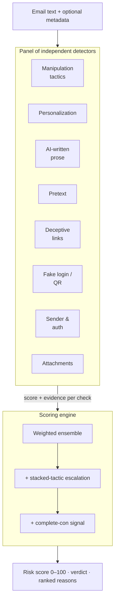

# PhishLens

An explainable detector for AI-generated spear-phishing emails. It scores an
email for the fingerprints of a modern, AI-assisted phishing attack and explains
*why* it's suspicious in plain language, so a security analyst can triage in
seconds instead of guessing.

## What this project does

PhishLens reads an email and runs it past a panel of independent checks, each
looking for one hallmark of an AI-assisted attack. It returns a single 0–100
risk score, a verdict, and — most importantly — the evidence behind every flag.
Nothing is a black box.

The checks cover:

- **Manipulation tactics** — the six classic persuasion levers (authority,
  urgency, social proof, reciprocation, commitment, liking) phishing uses to
  short-circuit critical thinking.
- **Personalization** — whether the email knows the recipient's name, role, or
  employer: the tell of a researched, targeted attack rather than mass spam.
- **AI-written prose** — machine-generated lures read as unusually clean,
  uniform, and command-heavy ("robotic professionalism"). This flips the old
  rule: suspiciously *polished* text is now a red flag.
- **Pretext** — the scenarios attackers fabricate most: fake password/MFA
  resets, bonus and tax-refund bait, invoice and payment fraud.
- **Deceptive links** — lookalike domains, homograph tricks, URL shorteners,
  brand names buried in unrelated domains, and link text that points elsewhere.
- **Fake login prompts** — "Sign in with Microsoft/Google" credential-harvest
  pop-ups, and QR codes used to dodge link scanners.
- **Sender & authentication** — brand names sent from free Gmail accounts,
  typosquatted domains, failed SPF/DKIM/DMARC, and hijacked reply threads.
- **Risky attachments** — macro-enabled documents, disguised executables, and
  double-extension tricks.

Two things set it apart from a simple red-flag counter:

1. **It escalates when tactics stack.** An email combining several manipulation
   levers is far more dangerous than one using a single lever — the pressure
   compounds. PhishLens raises risk sharply when tactics appear together.
2. **It recognizes a complete con.** The most effective lures are *relevant*
   (personalized), *credible* (look legitimate), and *threatening* (demand
   urgent action) all at once. PhishLens specifically flags emails where all
   three converge.

## Why I built it

Old phishing was easy to catch: typos, bad grammar, obviously fake links.
Simple keyword and blacklist filters handled it.

AI broke that. Attackers now use large language models to write clean, fluent,
hyper-personalized emails at scale — each one unique, each tailored to the
target using public information scraped from LinkedIn and company sites. These
sail past traditional filters because there's no typo to catch and no reused
template to blacklist. AI-generated lures now bypass commercial spam filters the
large majority of the time and hit click-through rates rivaling human red teams.

PhishLens is the defensive counterpart to my MSc thesis, which studied exactly
how that offensive pipeline works. The thesis showed how the attack is built;
this tool detects it.

## Tech stack

- **Python 3.10+**, standard library only — the core has zero third-party
  dependencies and runs anywhere.
- **pytest** for the test suite.
- **GitHub Actions** for CI (tests run on Python 3.10 and 3.12 on every push).
- Optional **FastAPI** wrapper for exposing the analyzer as an HTTP endpoint.

## Architecture / workflow



Every check is a small function that scores one signal and returns its evidence.
A scoring engine combines them into a weighted risk rating, then layers on the
two cross-cutting signals (stacked tactics, complete con). Because the detectors
are independent, each is trivially unit-tested and the system is hard to fool
with any single trick — an ensemble of diverse checks is more robust than one
monolithic classifier. The AI-writing detector sits behind a clean interface, so
a heavier machine-learning model can replace the rule-based scorer without
touching anything else.

## How to run it

```bash
# analyze an email file, passing what you know as flags
python -m phishlens.cli examples/spear_phish.txt \
  --name Niki --role analyst --employer Deloitte --brand Microsoft \
  --from '"IT Support" <it-support@gmail.com>' --dmarc fail

# pipe from stdin and get JSON
cat email.txt | python -m phishlens.cli - --json
```

Or call it directly from Python:

```python
from phishlens import analyze

result = analyze(
    "Hi Niki, the IT department requires all employees to verify your account "
    "within 24 hours to avoid suspension. Sign in with Microsoft: "
    "https://microsoft.login-verify.ru/sso",
    from_header='"IT Support" <it-support@gmail.com>',
    claimed_brand="Microsoft",
    recipient_name="Niki",
    headers={"spf": "softfail", "dmarc": "fail"},
)

print(result.risk_score, result.verdict.value)   # 95.7 high_risk
for reason in result.reasons:
    print(" -", reason)
```

Run the tests with `pip install pytest && pytest -q`.

## Example output

```
Risk: 95.7/100   Verdict: HIGH_RISK

Why:
  - stacked persuasion: 5 manipulation tactics combined (authority, liking,
    reciprocation, scarcity, social proof) — layered pressure raises click risk
  - complete con: relevant + credible + threatening all present
  - link: brand "microsoft" hidden in subdomain of unrelated host
    (microsoft.login-verify.ru)
  - credential harvest: fake "Sign in with Microsoft" prompt
  - sender: corporate display name "IT Support" sent from a free Gmail address
  - authentication: DMARC failed
  - personalization: addresses recipient by name, role, and employer
```

A benign message, by contrast, scores in the single digits and returns a
`BENIGN` verdict with no flags.

## What I learned

- **Detecting an attack is harder than describing it.** Inverting my thesis from
  "here's how the attack works" into "here's how to catch it" forced far more
  precision — a vague description doesn't compile.
- **The old rules invert under AI.** Clean grammar used to mean "legitimate."
  Against LLM-written lures, polish is now a signal *for* suspicion, not against.
- **Explainability is a feature, not a nicety.** An analyst won't trust a score
  they can't interrogate, so every check earns its output by showing evidence.
- **Independent, composable checks beat one big classifier** — easier to test,
  easier to reason about, and harder to defeat with a single evasion.

## Possible improvements

- Add an `.eml` parser so raw mailbox exports flow through the metadata-dependent
  checks end-to-end, instead of passing details as flags.
- Swap the rule-based AI-writing detector for a machine-learning model behind the
  existing interface.
- Evaluate against a labeled public phishing corpus to report precision/recall,
  turning "I built a detector" into "I measured one."
- Extend the keyword banks beyond English.

## Disclaimer

Defensive tooling only. PhishLens analyzes emails for risk; it does not
generate, send, or facilitate phishing.
